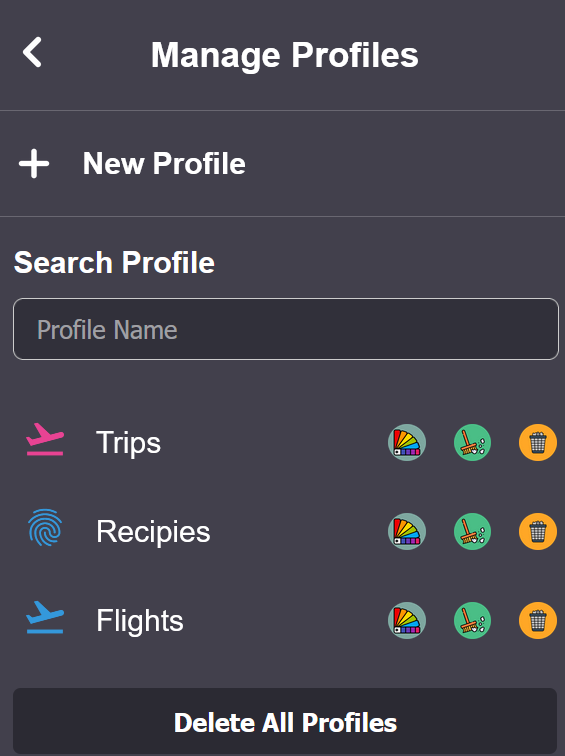
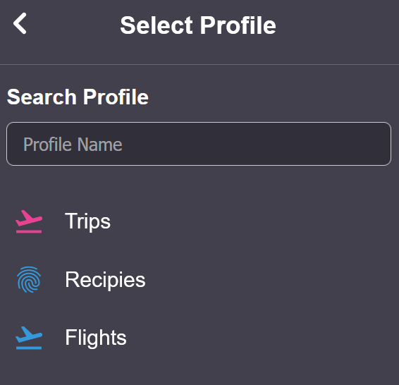

# Container Profile Manager (Firefox extension)

A Firefox add-on that builds on contextual identities (containers) to give every profile its own browsing history, plus a richer popup for creating and switching between profiles.

## Project inspiration
- I often research multiple topics at once and wanted isolation beyond cookies: separate history, tabs, and a quick way to jump between workstreams.
- Firefox Multi-Account Containers already give cookie isolation; this project layers a custom history per container and a guided UI on top.
- The repo is intentionally preserved mid-flight (late 2023) as a showcase of the idea and the road so far.

## Features
- Create new container profiles with custom color and icon (uses contextualIdentities.create and persists metadata in browser.storage.local).
- Popup UI with multiple views: main actions, create profile, manage profiles (UI skeleton), list/search profiles, information page, and a dedicated history view.
- Separate history per profile: background listener records webNavigation.onCompleted events into an IndexedDB database per container.
- History viewer groups entries by date buckets, supports search, and can reopen a link either in the current profile or a selected profile.
- Quickly open a new tab in any saved profile from the popup list.
- Old prototypes kept in `old/` for reference.

## Project status
- UI flows and IndexedDB history logging are implemented; core container creation works.
- Manage/Delete/Clear actions are mostly UI-only (functions exist but are not wired to buttons yet).
- "Always open in..." and "Reopen in..." behaviors are placeholders.
- Background script references a non-existent `views/history.html` window opener; history is currently accessed via the popup view.
- Manifest is now MV2-friendly for temporary loading in Firefox (browser_action, background script, flattened web_accessible_resources).

## Is it runnable?
Yes; no build step is needed and the manifest is already MV2.

### Load for review
1) Enable containers in Firefox: set `privacy.userContext.enabled` to `true` in `about:config` (or install the official Multi-Account Containers add-on).  
2) Go to `about:debugging#/runtime/this-firefox` > Load Temporary Add-on > select `manifest.json` from this folder.  
3) Click the toolbar icon to open the popup, create a profile, and browse in that profile to see history populate.  
4) Command-line option: `web-ext run --source-dir .` (from the Mozilla `web-ext` tool).

### Use-case scenarios
- Research threads: spin up a "Project X" profile to isolate searches, citations, and tabs from personal browsing.
- Client/account isolation: keep each client's logins, cookies, and history in its own container for context switching.
- Shopping or travel: separate comparison shopping or trip planning from everyday accounts to limit cross-tracking.
- Clean experiments: create a fresh container to test a site without existing cookies or history influence.

### Automation for testers (npm)
- Prerequisite: Node.js + npm. Install dev deps once: `npm install`.
- Run with containers enabled automatically: `npm run dev` (wraps `web-ext run` and sets the container prefs).
- Lint the extension: `npm run lint`.
- If you prefer to avoid npm, install `web-ext` globally and run the equivalent command directly.

If you prefer MV3, the background script needs to become a service worker and the `web_accessible_resources` format kept as-is; nothing is wired for MV3 yet.

### Screenshots
- Popup main view: 
- Manage profiles: 
- Action menu (“Always open this site in…”): 

## Tech notes
- Popup is a multi-view single page; `scripts/mainPopup/popup.js` fetches HTML partials from `views/` and toggles visibility.
- Custom history storage lives in IndexedDB with one database per profile; metadata (name, icon, color, cookieStoreId) is kept in `browser.storage.local`.
- History grouping and search live in `scripts/utilities/historyView.js`; background capture happens in `scripts/background.js`.
- Icon/color lookup tables and container listing live in `scripts/utilities/general.js`; container creation in `scripts/utilities/createView.js`.
- Favicons are pulled from `https://www.google.com/s2/favicons` for display in the history view.
- Legacy experiments and alternative UIs are preserved under `old/`.

## Next improvements
- Decide on MV2 vs MV3 and make the manifest/load path solid; add `web-ext lint` to catch regressions.
- Wire up manage actions (delete profile, clear history) and the "Always/Reopen/Sort tabs" flows.
- Add basic error handling/UX states for missing permissions or disabled containers.
- Replace the `history.html` reference or remove the unused opener; add a dedicated history tab view if desired.
- Add screenshots/GIFs and a short demo video for GitHub.
- Add lightweight tests (smoke test via `web-ext run` script) and a packing script for releases.
